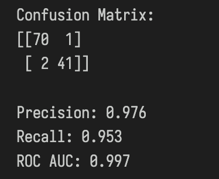
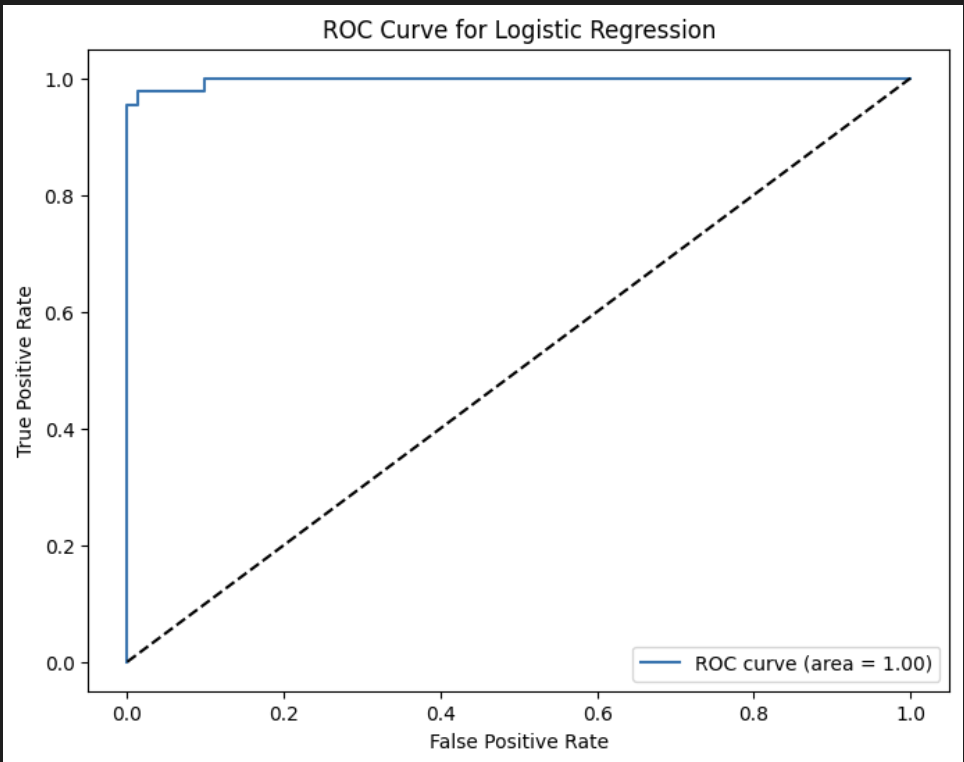
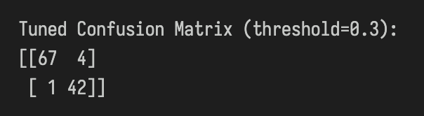

# AI & ML Internship - Task 4: Binary Classification (Logistic Regression)

## Objective
To implement and understand binary classification using Logistic Regression on the Breast Cancer Wisconsin Diagnostic Dataset.

### 1. Dataset Selection and Loading
- Used the Breast Cancer Wisconsin Diagnostic Dataset
- Converted diagnosis labels (M/B) to binary values (1/0)

### 2. Data Preprocessing
- Train/test split (80/20 ratio)
- Feature standardization using `StandardScaler`

### 3. Model Training
- Initialized and trained Logistic Regression model

### 4. Model Evaluation
Key evaluation metrics and visualizations:

  
*Confusion Matrix, Precision, Recall, and ROC AUC Score*

  
*ROC Curve Visualization (AUC = 0.997)*

### 5. Threshold Tuning
Demonstrated impact of changing classification threshold from 0.5 to 0.3:

  
*Comparison of prediction results with threshold=0.3*

### 6. Sigmoid Function Explanation
Core mathematical component of logistic regression:

  
*Visualization and formula explanation of sigmoid function*

## Key Concepts Demonstrated
- Logistic regression implementation using Scikit-learn
- Importance of feature scaling
- Interpretation of classification metrics
- Threshold tuning for precision/recall tradeoff
- Mathematical foundation using sigmoid function

This task provided practical experience in applying Logistic Regression for binary classification, understanding key evaluation metrics, and the concepts of thresholding and the sigmoid function.
